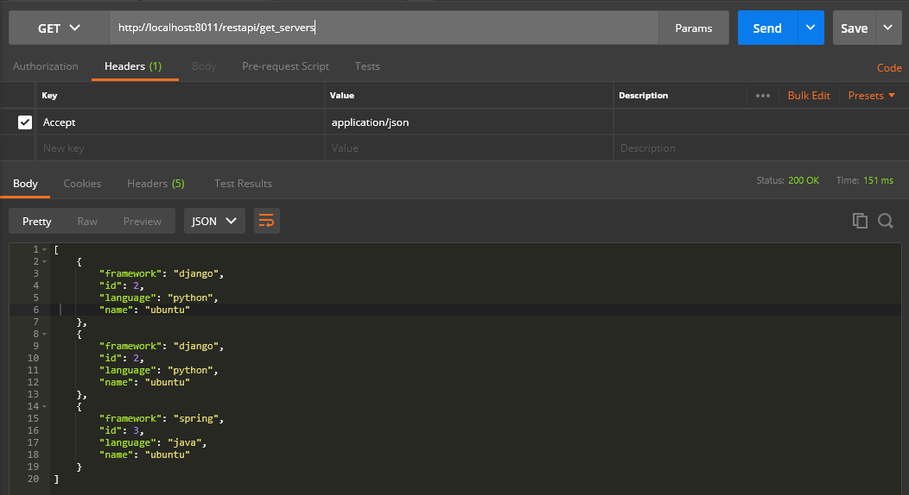
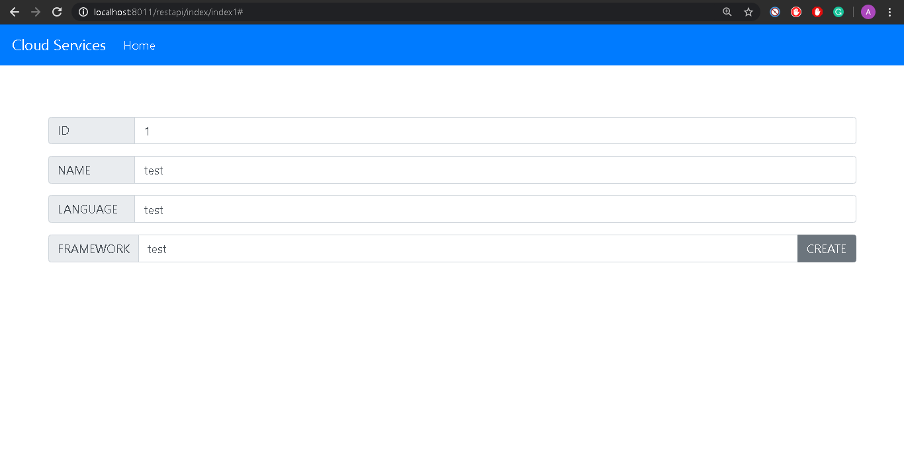
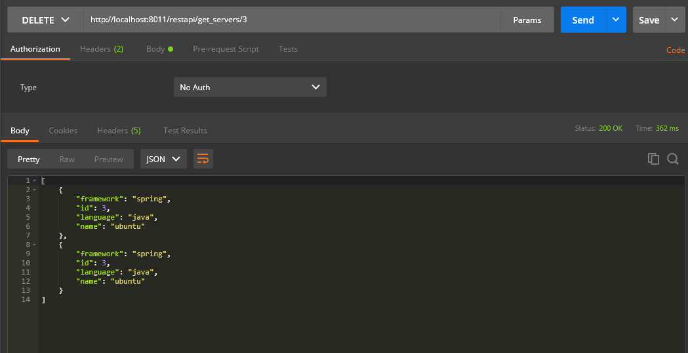
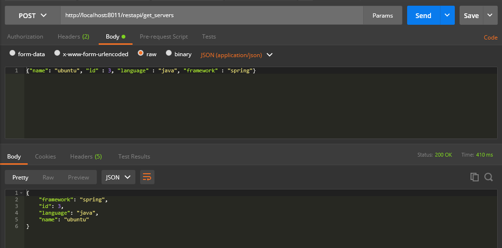
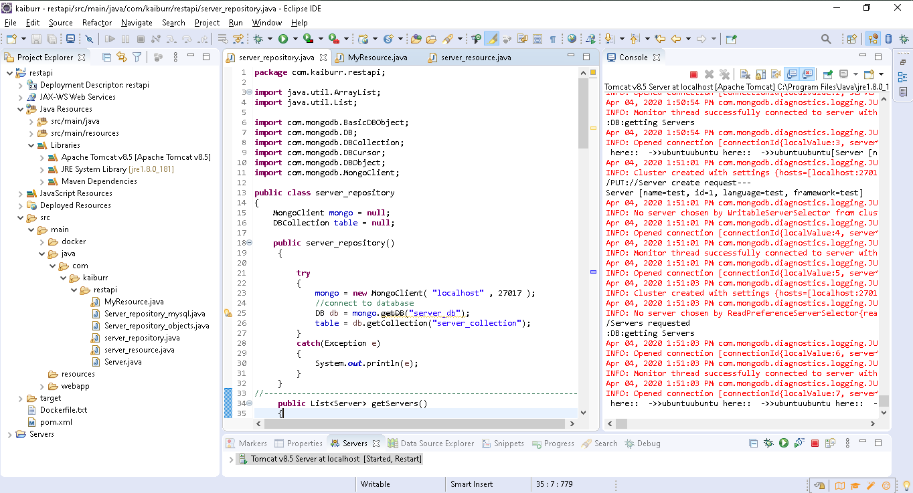

# REST API  
### Maven based REST-Api using MongoDB 
An application in java which provides a REST API with endpoints for searching, creating and deleting “server” objects: 

* #### @GET servers :-
	Returns all the servers if no parameters are passed. When server id is passed as a parameter - return a single server or 404 if there’s no such a server.
```java

	@GET
	@Produces({MediaType.APPLICATION_JSON,MediaType.APPLICATION_XML})
	public List<Server> getServers(){ return repo.getServers(); }
	
```
	 
	 

* #### @PUT a server :-
	 The server object is passed as a json-encoded message body. Here’s an example:<br />
```bson
		{ 
			“name”: ”my centos”,
		 	“id”: “123”,
		  	“language”:”java”,
		   	“framework”:”django” 
		}
```
```java
		@PUT
		@Path("/{name}-{id}-{language}-{framework}")
		@Consumes({MediaType.APPLICATION_JSON,MediaType.APPLICATION_XML})
		public Server put_create_server(@PathParam("name") String name,@PathParam("id") int id, @PathParam("language") String language,@PathParam("framework") String framework)
		{
			//code
		}
```




* #### @DELETE a server:-<br />
	 The parameter is a server ID. 
```
	@DELETE
	@Path("/{id}")
	@Produces({MediaType.APPLICATION_JSON,MediaType.APPLICATION_XML})
	public List<Server> kill_server(@PathParam("id") int id)
	{		
		List<Server> s = repo.get_server(id);
		System.out.println("/Server killing !!  * killing is bad");
		Iterator iterator = s.iterator();
		if(iterator.hasNext())
		{
			repo.delete(id);
		}
		return s;
	} 
```
 

* #### @POST a server :-
	 The server object is passed as a json-encoded message body.
		 

* #### @GET (find) servers by name :-<br />
	 The parameter is a string. Must check if a server name contains this string and return one or more servers found. Return 404 if nothing is found.
```
	@GET
	@Path("/{id}")
	@Produces({MediaType.APPLICATION_JSON,MediaType.APPLICATION_XML})
	public List<Server> get_server(@PathParam("id") int id)
	{		
		System.out.println("/a Server requested ::" + id);

		return repo.get_server(id);
	} 
```
	

The “Server” objects are stored in ### MongoDB database.
	


