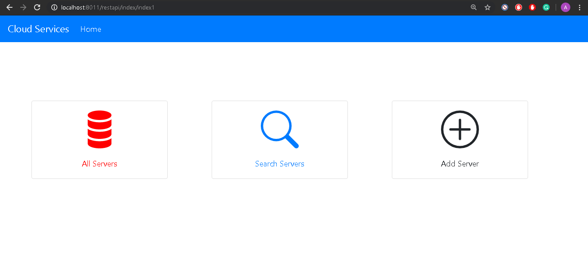

# REST API  
### Consuming a RESTful Web Service with AJAX-Bootstraping
A basic WEB UI frontend for an application created using 
### Bootstrap framework.
Using 
### AJAX methods 
to create, show and delete records from the UI : 
	

* #### @GET servers :-
	 Should return all the servers if no parameters are passed. When server id is passed as a parameter - return a single server or 404 if there’s no such a server.


* #### @PUT a server :-
	 The server object is passed as a json-encoded message body. Here’s an example:<br />
```
		{ 
			“name”: ”my centos”,
		 	“id”: “123”,
		  	“language”:”java”,
		   	“framework”:”django” 
		}
```

	 


* #### @DELETE a server:-<br />
	 The parameter is a server ID. 

	 

* #### @POST a server :-
	 The server object is passed as a json-encoded message body.
		 

* #### @GET (find) servers by name :-<br />
	 The parameter is a string. Must check if a server name contains this string and return one or more servers found. Return 404 if nothing is found.

	 


